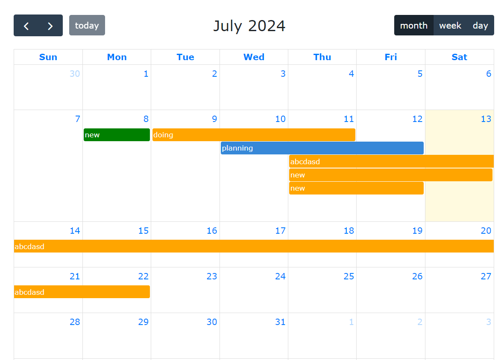

# TodoList

TodoList is a work management system with features for managing tasks and displaying them on a calendar.


## Main Features

1. **Add, Edit, Delete Tasks**

   - A task includes the following information:
     - Work Name
     - Starting Date
     - Ending Date
     - Status (Planning, Doing, Complete)

2. **Display Tasks on a Calendar**
   - Display tasks in Day, Week, Month views

## Installation and Running the Project

### Requirements

- Docker

### Installation

1. Clone the repository:

   ```sh
   git clone https://github.com/yourusername/TodoList.git
   ```

### Running the Project

1. create container:

   ```sh
   docker-compose up -d
   ```

2. Open your browser and navigate to:

    ```sh
    http://localhost:3000
    ```

## Directory Structure

- `/src`
  - `/components` - React components used in the application.
  - `/pages` - Application pages.
  - `/services` - Services for communicating with the backend (if any).
  - `/utils` - Utility functions for the application.

## Using Third-Party Libraries

### Calendar Display

To display the calendar, you can use the [FullCalendar](https://fullcalendar.io/) or [react-calendar](https://github.com/wojtekmaj/react-calendar) library. Below is an example of how to use FullCalendar:

1. Install FullCalendar:

   ```sh
   npm install @fullcalendar/react @fullcalendar/daygrid @fullcalendar/timegrid
   ```

2. Use FullCalendar in your project:

   ```jsx
   // src/components/CalendarView.js
   import React from "react";
   import FullCalendar from "@fullcalendar/react";
   import dayGridPlugin from "@fullcalendar/daygrid";
   import timeGridPlugin from "@fullcalendar/timegrid";

   const CalendarView = ({ events }) => {
     return (
       <FullCalendar
         plugins={[dayGridPlugin, timeGridPlugin]}
         initialView="dayGridMonth"
         events={events}
       />
     );
   };

   export default CalendarView;
   ```

## Contribution

If you want to contribute to the project, please create a pull request or open an issue on GitHub.

## License

This project is licensed under the MIT License. See the LICENSE file for more details.
